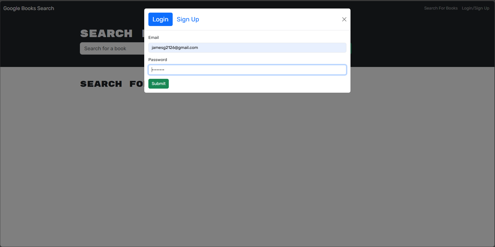
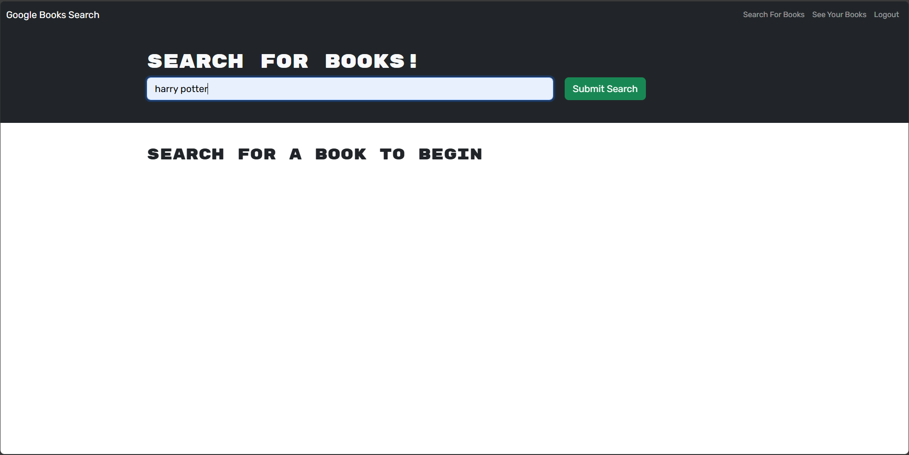
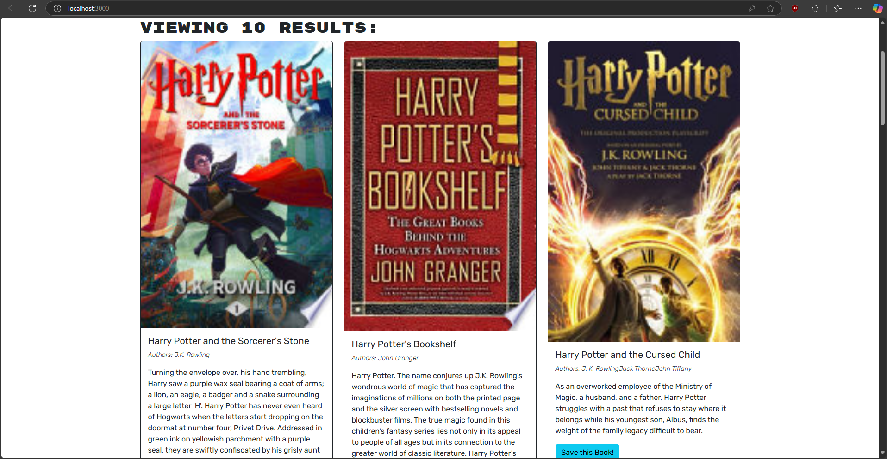
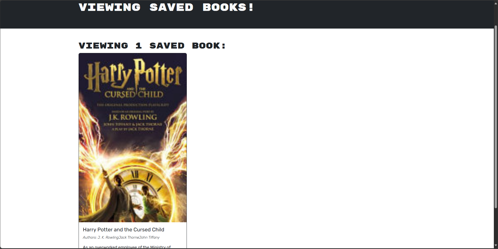

# challenge21-Book-Search-Engine

## Description

A full-stack MERN application that allows users to search for books using the Google Books API and save their favorite books to their account. This application was refactored from a RESTful API to use GraphQL with Apollo Server.

## Features

- User Authentication (signup/login)
- Book search using Google Books API
- Save books to user profile
- Remove saved books from profile
- GraphQL API with Apollo Server
- React front-end
- MongoDB database
- Express.js server

## Installation

1. Clone the repository:
   ```bash
   git clone git@github.com:JoseGuache/challenge21-Book-Search-Engine.git
   ```
2. Navigate to the project directory
3. Install dependencies:
   ```bash
   npm install
   ```
4. Set up environment variables as needed

## Usage

1. Start the development server:
   ```bash
   npm run develop
   ```
2. Open your browser and navigate to `http://localhost:3000`
3. Features available:
   - Search for books using the search bar
   - Create an account or log in
   - Save books to your profile
   - View your saved books
   - Remove books from your saved list

## Technologies Used

- MongoDB
- Express.js
- React
- Node.js
- GraphQL
- Apollo Server/Client
- JWT Authentication
- Google Books API
- Bootstrap

## Screenshots


*Login/Signup page*


*Search for books and view their details*


*Search for books and view their details*


*View your saved books collection*

## Repository

[View on GitHub](https://github.com/JoseGuache/challenge21-Book-Search-Engine)

## Deployed Application

[View Deployed Application](https://challenge21-book-search-engine-nb95.onrender.com)

## Credits

- [Google Books API Documentation](https://developers.google.com/books)
- [Apollo GraphQL Documentation](https://www.apollographql.com/docs/)
- [Professional README Guide](https://coding-boot-camp.github.io/full-stack/github/professional-readme-guide)

## License

This project is licensed under the MIT License - see the [LICENSE](https://opensource.org/licenses/MIT) for details.

[](https://opensource.org/licenses/MIT)